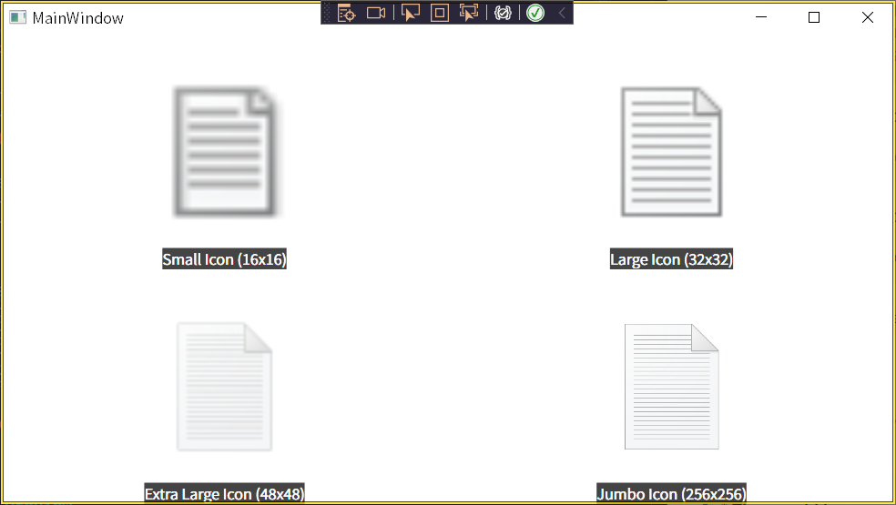
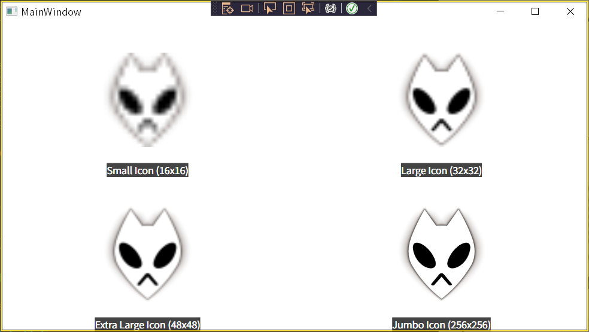
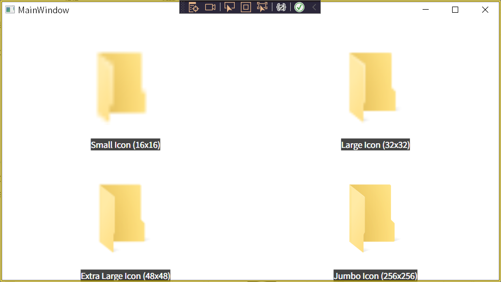
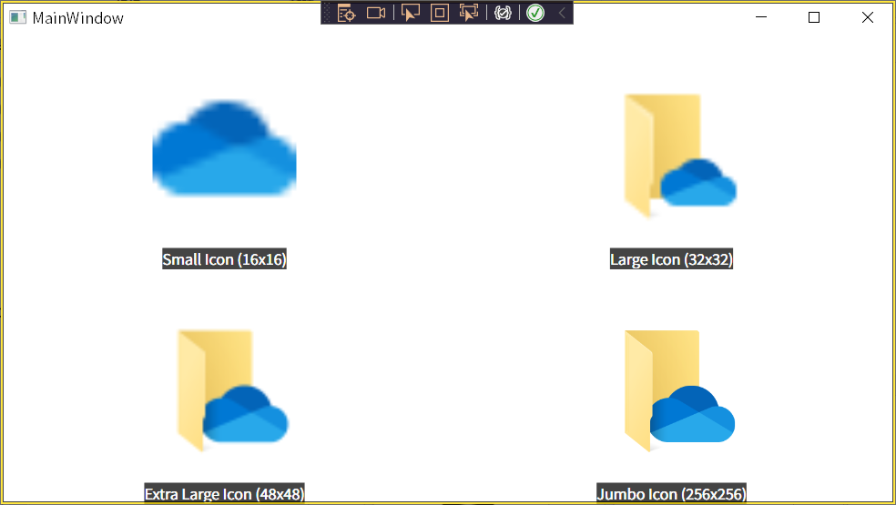

# win32-icon-extractor

A .NET win32 helper to extractor icon from the given path.

## Usage

1. Copy the `source/IconExtractor.cs` to your C# project.
2. Enable `unsafe` in your project.
   1. Edit your `***.csproj` project file.
   2. Add below:
      ```xml
        <PropertyGroup>
            <OutputType>WinExe</OutputType>
            <TargetFramework>net6.0-windows</TargetFramework>
            <Nullable>enable</Nullable>
            <UseWPF>true</UseWPF>

            <!-- Add below -->
            <AllowUnsafeBlocks>true</AllowUnsafeBlocks>
        </PropertyGroup>
      ```
3. Add using in your source code.
   ```csharp
   using Studio.Shiba.Win32Helpers;
   ```
4. Then use the function:
   ```csharp
   var iconset = IconExtractor.ExtractIconFromPath(fileOrFolderPath);
   ```

The members of `iconset` includes:
* `SmallIcon` - 16 x 16
* `LargeIcon` - 32 x 32
* `ExtraLargeIcon` - 48 x 48
* `JumboIcon` - 256 x 256

> **\* They could be `null` if extracted failed.**

-----

## Results Preview

You could use `source/IconExtractorTestWindow.csproj` to test the extracted result from different types of files.

Just dragging the file you would to test into the window.

### type: file



### type: lnk link



> Arrow would not be attached to the extracted result.

### type: folder





> If the folder contains special icon, the special icon would be extracted.

